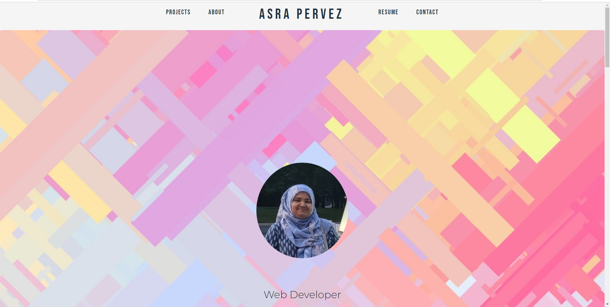
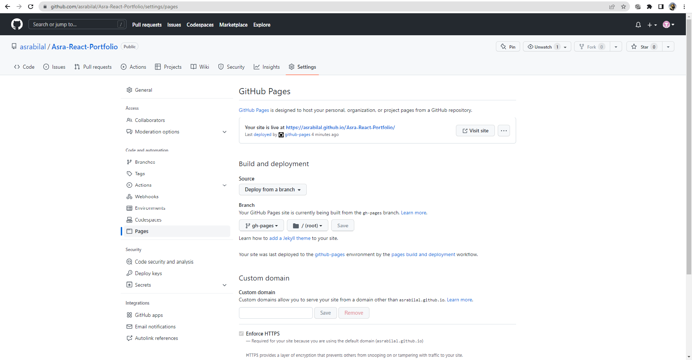
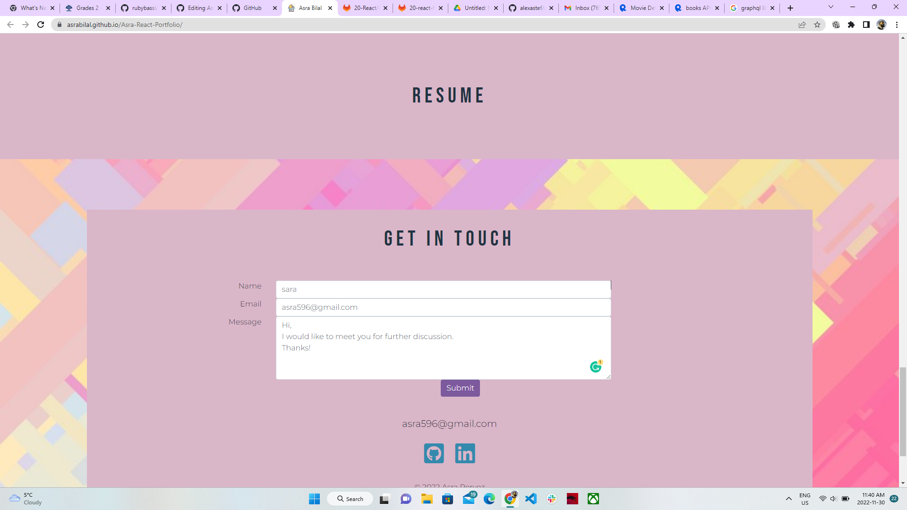

# 20 React: React Portfolio

 

  ## Licensing:
  
  
  ## Table of Contents 
  - [Description](#description)
  - [Installation](#installation)
  - [Usage](#usage)
  - [Contribution](#contribution)
  - [Testing](#testing)
  - [Questions](#questions)
  - [Additional Info](#additional-info)
 
 
  ## Description:
  I created my personal portfolio using React and Bootstrap. I will continually adding projects, modifying content, and updating the look and functionality.

  Please check out my work at https://asrabilal.github.io/Asra-React-Portfolio/!
  
  ## Installation:
  To build a similar, single page portfolio or website for yourself, you'll want first create a new React app:

  npx create-react-app <projectname>
  Then for the single page, smooth scrolling, install react-scroll. To deploy to Github Pages, install gh-pages:

  npm install react-scroll gh-pages
  You can also fork and clone this repo to use as a template and then just run npm install
  
  ## Usage:
  You'll be able to run the app locally by running npm start:

 npm start
 All your changes should update the local host in real time. If you want to deploy your app, you'll need to make a few changes to the package.json file. Directions      below for deploying to Github Pages:

 Add a homepage: to your package.json in the root
 "homepage": "https://asrabilal.github.io/Asra-React-Portfolio/"
  In the "scripts" property of your package.json, add two scripts: scripts

  Now, after you merge your changes and pull the most up-to-date master, open a new terminal and run npm run deploy:

  npm run deploy
  This creates a new branch, gh-pages. Open your deploy settings in Github and change the deploy branch to gh-pages deploysettings

  Every time you want your deployed site to update with the changes you've made, you need to run npm run deploy
  
  ## License:
  MIT
  
  ## Contribution:
  No contributions at the moment. If anyone wishes to provide contributions, please contact the author.
  
  ## Testing:
  Testing not required.
  
  ## Questions:
  [HERE](https://github.com/asrabilal)
  
  ## Screenshots:
   
   
 
 ## Demo:
   [firstdemo](https://drive.google.com/file/d/1gAELoKrfxXF6-MmeTvM6bkA0E9W6muCV/view)
   [seconddemo](https://drive.google.com/file/d/1IhcUsQMF8tr-mILv5t6jGZAekn9lEhiH/view)
   
  
  ## Additional Info:
  - Github: [asrabilal](https://github.com/asrabilal)
  - Email: asra596@gmail.com 

  

    
    
    
    
    
    
    

## URLs
Github repository link: https://github.com/asrabilal/Asra-React-Portfolio.git  
Deployed application link:https://asrabilal.github.io/Asra-React-Portfolio/  

